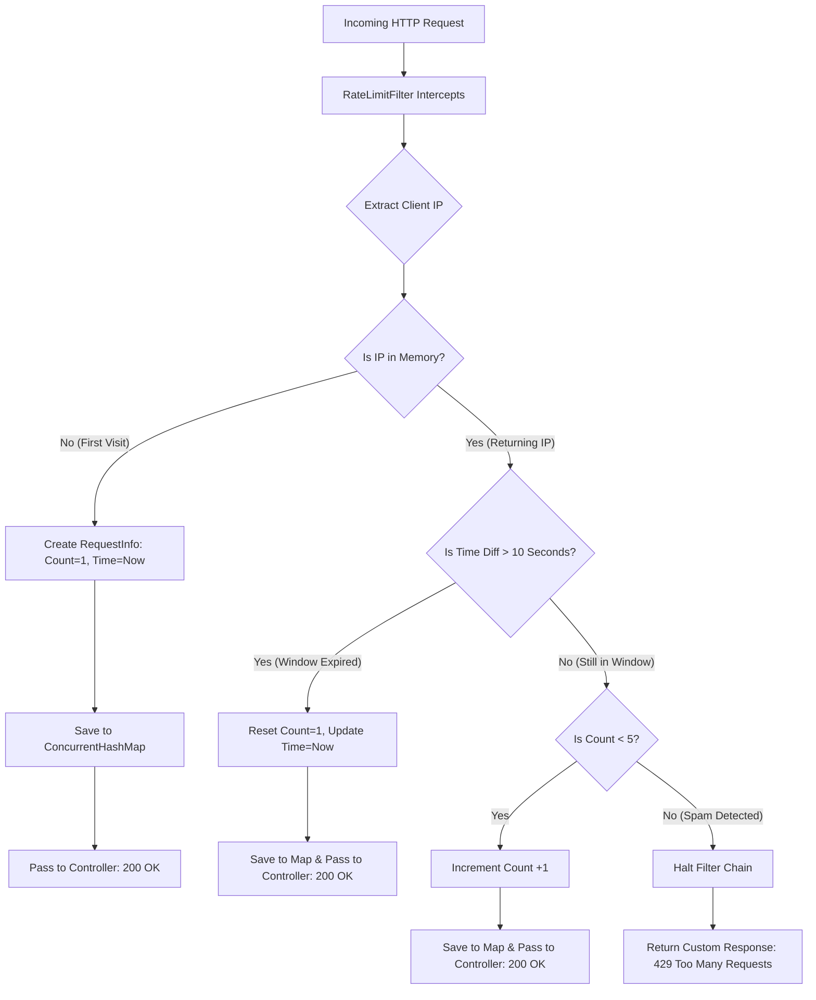

# 🚀 Day 0: The Foundation & Setup

> **Project Goal:** Establish a robust, thread-safe Spring Boot foundation to build a custom API Rate Limiter from scratch.
> **Constraint:** Strict "No-AI" coding policy. All implementations rely on official documentation, raw problem-solving, and manual debugging.


---

# 🛡️ Day 1: The Gatekeeper (API Rate Limiter)

> **Core Concept:** Protecting API endpoints from abuse and spam using a custom-built Fixed Window Counter algorithm.
> **Constraint:** Strict "No-AI" coding policy. Built entirely from scratch using raw Java and Spring Boot documentation.

---

## ❓ The What and The Why

* **What is it?** A security layer (filter) that sits in front of a web server. It limits how many times a single user can hit the API within a specific timeframe (5 requests per 10 seconds).
* **Why build it?** To prevent server crashes from DDoS attacks, stop users from spamming endpoints, and deeply understand how HTTP requests flow through a backend system.
* **Why not use a library?** Building it from scratch forces a deep understanding of thread-safe memory handling (`ConcurrentHashMap`), custom HTTP responses, and filter chains.

---

## 🧠 Data Flow & Architecture

Below is the logical flow of how the custom rate limiter processes every incoming request.


## 🛠️ how it was built (step-by-step)

### 1. the bouncer (`RateLimitFilter.java`)
i made a class that extends `OncePerRequestFilter`. this acts like a guard that catches every single http request before it even reaches the main controller.

### 2. the custom memory object (`RequestInfo.java`)
a normal map can only hold one value. but i needed to track two things:
* `requestCount`: how many times the user clicked.
* `windowStartTime`: the exact time they made their first click.
  so, i built a custom object just to hold these two variables together safely.

### 3. the thread-safe vault (`ConcurrentHashMap`)
spring boot handles many users at the same time using different threads. if i used a normal `HashMap`, the app would crash if two people clicked at the same millisecond. so i used `ConcurrentHashMap` to safely link a user's ip address to their `RequestInfo` data.

### 4. the math and the block
i used `System.currentTimeMillis()` to check the time difference. if a user makes more than 5 requests inside a 10-second window, the filter completely stops the process. it then manually writes a `429 too many requests` error directly back to the user using the `HttpServletResponse`.

---

## 📂 project structure

```text
backend-daily-labs/
├── README.md (master 7-day tracker)
└── day-01-rate-limiter/
    ├── pom.xml
    ├── README.md (this specific file)
    └── src/main/java/com/Rohan/RateLimiter/
        ├── RatelimiterApplication.java
        ├── TestController.java
        ├── RateLimitFilter.java
        └── RequestInfo.java

```
## 🧪 how to test

1. open the project in your ide and run the `RatelimiterApplication.java` file.
2. open **postman**.
3. make a `GET` request to `http://localhost:8080/api/test`.
4. it will show `200 ok` and your success message.
5. click the "send" button 6 times really fast.
6. on the 6th click, it will block you and show a red `429 too many requests` status code.
7. wait 10 seconds, click send again, and you will get `200 ok` again.

---

## 📚 official resources used

since this was built completely from scratch without ai writing the code, i used these official docs to figure out the logic:
* [spring boot filter docs](https://docs.spring.io/spring-framework/reference/web/webmvc-filters.html)
* [java 17 ConcurrentHashMap docs](https://docs.oracle.com/en/java/javase/17/docs/api/java.base/java/util/concurrent/ConcurrentHashMap.html)
* [mdn web docs for 429 status](https://developer.mozilla.org/en-US/docs/Web/HTTP/Status/429)