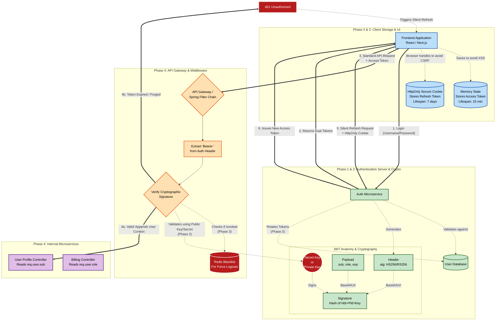
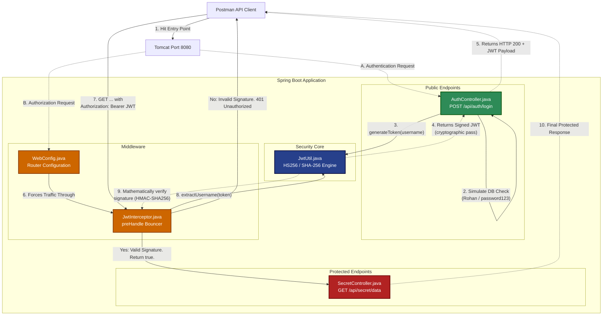

# 🔐 Day 6: The Mini-Auth0 (JWT Security Engine)

> **Core Concept:** Implementing stateless API security using JSON Web Tokens (JWT) and custom request filtering.
> **Constraint:** Built from scratch without relying on Spring Security's auto-configuration magic to demonstrate a deep understanding of cryptographic token validation and middleware interception.


---

## ❓ The What and The Why

* **What is it?** A stateless authentication server that issues cryptographically signed tokens to verified users, and a middleware filter that protects sensitive API endpoints from unauthorized access.
* **Why build it?** Standard REST APIs are stateless. To secure an enterprise application, you cannot store user sessions in server memory (it won't scale across multiple servers). System design interviews demand a strong understanding of how to use JWTs to securely identify users, pass authorization roles, and protect internal microservices without database lookups on every single request.
---
## A Complete Guide to Base64 Encoding and JWTs

## What is Base64 Encoding?
Base64 encoding is a method used to convert raw binary data (like images, documents, or compiled code) into a readable string of standard text characters (ASCII).

The "64" refers to the specific set of 64 characters used to represent the data:
* Uppercase letters (**A-Z**)
* Lowercase letters (**a-z**)
* Numbers (**0-9**)
* The plus symbol (**+**) and the forward slash (**/**)
* *(The equals sign (**=**) is also used at the end of the string as "padding" to ensure the data aligns correctly).*

## Why Do We Need It?
Many communication protocols (like HTTP or SMTP) and text-based formats (like JSON or XML) were originally designed to handle standard text, not raw binary data. If you attempt to send raw binary data directly through these systems, the system might misinterpret the raw 1s and 0s as formatting commands, which can corrupt the file.

Base64 acts as a universal translator. It wraps fragile binary data in a safe, standardized text format so it can be transmitted or stored without getting mangled.

## How It Works
At a high level, the system processes the raw data by grouping it into blocks of 24 bits (3 bytes). It then splits those 24 bits into four smaller chunks of 6 bits each. Because 6 bits can represent exactly 64 different values, each of those smaller chunks can be perfectly mapped to one of the 64 characters in the Base64 alphabet.

---

## How Base64 Integrates with JWT Authentication
JSON Web Tokens (JWTs) are the industry standard for stateless API authentication. A JWT consists of three parts separated by dots: `Header.Payload.Signature`.

The **Header** and the **Payload** are originally written as standard JSON objects. Base64 (specifically a URL-safe variant called **Base64Url**) is the mechanism that makes them transmittable.

### 1. HTTP Header and URL Safety
When a frontend makes a request to a protected backend route, it usually sends the JWT inside the HTTP `Authorization` header. Raw JSON contains double quotes, curly braces, and spaces. If you put raw JSON directly into an HTTP header or a URL parameter, it would break the HTTP protocol.

Base64Url encoding flattens that JSON into a continuous, safe string of alphanumeric characters that web servers can handle seamlessly. *(Note: Base64Url removes the `=` padding and swaps `+` and `/` for `-` and `_` so it doesn't break URLs).*

### 2. Standardization for the Signature
The Signature part of a JWT is created by hashing the Header and Payload using a secret key. Cryptographic hashing algorithms require a highly consistent string of bytes to generate a reliable hash. By encoding the JSON into a strict Base64 string first, both the server and the client are guaranteed to be hashing the exact same sequence of characters, preventing signature verification failures.

### ⚠️ The Golden Rule: Encoding is NOT Encryption
Base64 simply translates data; it does not hide it. Because the Header and Payload are merely Base64 encoded, **anyone who intercepts the token can decode it and read the contents in plain text.** You should include user roles, IDs, and expiration dates in the payload, but you should **never** put passwords, bank details, or sensitive user data inside a JWT. Security comes from the *Signature* (which prevents tampering), not from the Base64 encoding (which is strictly for safe transport).

---

## Scenario: Constructing the JWT Payload
Here is a look at what happens to the JSON data before it gets sent to the client as part of a JWT.

**Input (Raw JSON Payload):**
```json
{
  "sub": "user_890",
  "name": "Rohan",
  "role": "admin",
  "exp": 1716239022
}
```
**Output (Base64Url Encoded Payload):**
```text
eyJzdWIiOiJ1c2VyXzg5MCIsIm5hbWUiOiJSb2hhbiIsInJvbGUiOiJhZG1pbiIsImV4cCI6MTcxNjIzOTAyMn0
```
---
## Phase 1: The Core Fundamentals of JWT Authentication

Before writing any code, you need to understand the fundamental shift in how web applications handle user identities. This phase builds the mental models required to understand *why* JSON Web Tokens (JWTs) exist in the first place.

---

## 1. The Paradigm Shift: Stateful vs. Stateless Authentication

To appreciate JWTs, you first have to understand the old way of doing things.

### The Old Way: Stateful (Session-Based) Authentication
Imagine a nightclub where the bouncer holds a clipboard with a physical guest list.
1. **Login:** You show your ID. The server creates a "session" in its memory or a database (like Redis) and hands your browser a tiny, meaningless string called a **Session ID** (often stored in a cookie).
2. **Subsequent Requests:** Every time you click a button or load a page, your browser hands that Session ID back to the server.
3. **The Bottleneck:** The server has to pause, look down at its "clipboard" (database), search for your Session ID, and verify who you are.

**The Problem:** This is "stateful" because the server has to remember the *state* of every logged-in user. If your app goes viral and you scale up to 10 servers, Server A doesn't know about the session created on Server B. You are forced to build complex, centralized session databases just to keep track of who is logged in.

### The Modern Way: Stateless (JWT) Authentication
Now imagine a music festival. Instead of a clipboard, the ticketing booth checks your ID once and gives you a **tamper-proof, cryptographically signed wristband**.
1. **Login:** You provide your credentials. The server verifies them and issues a JWT (the wristband) containing your user data.
2. **Subsequent Requests:** You send the JWT with every API request.
3. **The Magic:** The server looks at the token, verifies the cryptographic signature (the tamper-proof seal), and immediately knows who you are. **It does not need to look up anything in a database.** **The Solution:** This is "stateless." The server forgets about you the moment the request ends. The token itself contains all the information needed to authenticate you. Any server, anywhere in the world, can verify your token instantly as long as it has the secret key to check the signature.

---

## 2. The Anatomy of a JWT

A JWT looks like a long, random string of gibberish, but it has a very strict, three-part structure separated by dots (`.`):
`Header.Payload.Signature`

### Part 1: The Header (The Metadata)
The header is a simple JSON object that answers two questions: *What is this?* and *How is it secured?*

```json
{
  "alg": "HS256",
  "typ": "JWT"
}
```

* **alg:** The hashing algorithm used for the signature (e.g., HMAC SHA-256).
* **typ:** The type of token (always JWT).
  *(This JSON is then Base64Url encoded to form the first part of the token).*

### Part 2: The Payload (The Cargo)
This is the actual data you want to transmit about the user. In JWT terminology, these pieces of data are called Claims.

```json
{
  "sub": "user_123",
  "role": "admin",
  "name": "Rohan"
}
```

*(This JSON is Base64Url encoded to form the middle part of the token).*

### Part 3: The Signature (The Tamper-Evident Seal)
This is the most critical part. It is what prevents a user from decoding their token, changing `"role": "user"` to `"role": "admin"`, re-encoding it, and hacking your system.

To create the signature, the server takes:
1. The encoded Header
2. The encoded Payload
3. A Secret Key (a long password that only the server knows)

It feeds all three into the hashing algorithm specified in the header (like HS256). The output is a unique cryptographic hash.

**How it works:** If a hacker alters even a single letter in the Payload, the hash of that new payload will completely change. When the server receives the modified token, it recalculates the signature. If the server's calculated signature doesn't match the signature on the token, the server knows it was tampered with and instantly rejects the request.

---

## 3. Standard Claims (The Vocabulary)
While you can put custom data in a payload (like `"theme": "dark"`), the JWT specification outlines Registered Claims. These are standard, pre-defined fields used universally by auth systems. You should always use these instead of inventing your own when applicable.

* **iss (Issuer):** The system that created and handed out the token. *(e.g., "https://auth.mycompany.com")*
* **sub (Subject):** The unique identifier of the user the token is about. This is usually your database's User ID. *(e.g., "10485739")*
* **aud (Audience):** The intended recipient of the token. If a token is meant for your "Billing API," your "Image Upload API" should reject it.
* **exp (Expiration Time):** The exact moment the token dies, represented as a Unix Numeric Date (seconds since Jan 1, 1970). Security best practices dictate this should be short (e.g., 15 minutes).
* **iat (Issued At):** The exact moment the token was created. Useful for calculating age.
* **nbf (Not Before):** A timestamp indicating the token is not valid until a certain time in the future. (Rarely used, but good to know).
---
# Phase 2: Cryptographic Internals & Security

Now that you understand what a JWT is and why it's used, we need to look at how it is secured. This phase separates junior developers from mid-level and senior engineers. It’s all about how the signature is generated and how you protect the token once it leaves the server.

---

## 1. The Core of Trust: Symmetric vs. Asymmetric Signing

The entire security of a JWT relies on its Signature (the third part of the token). If the signature is compromised, a hacker can forge tokens and gain admin access. There are two primary ways to create this signature.


[Image of symmetric vs asymmetric encryption diagram]


### A. Symmetric Signing (e.g., HS256)
**How it works:** You use a **single, shared Secret Key** to both *create* (sign) the token and *verify* the token.
* **The Analogy:** It’s like a combination safe. Anyone who knows the combination can put things in the safe (sign) and take things out (verify).
* **The Use Case:** This is perfect for monolithic backend applications. If you have a single server (or a cluster of identical servers) handling both the login process and the data fetching, they can safely share this one secret key via environment variables.

### B. Asymmetric Signing (e.g., RS256)
**How it works:** You use a **Key Pair**. A **Private Key** is used to *sign* the token, and a mathematically related **Public Key** is used to *verify* it.
* **The Analogy:** It’s like a king’s wax seal. Only the king has the official signet ring (Private Key) to stamp the wax. However, anyone in the kingdom can look at the stamped wax (Public Key) and verify that it genuinely came from the king.
* **The Use Case:** This is mandatory for scalable microservice architectures.
    * Your central **Auth Service** holds the Private Key and generates the JWTs.
    * Your downstream services (like a Payment Microservice, a Notification Microservice, or an API Gateway) only hold the Public Key.
    * They can independently verify the token's authenticity without ever knowing the secret used to create it. If a downstream service is hacked, the attacker only gets the Public Key, meaning they still cannot forge new tokens.

---

## 2. The Infamous "None" Algorithm Vulnerability

When learning system design and security, it is crucial to study past failures.

Early on, the JWT specification included an algorithm called `"none"`. This was intended for situations where the token had already been verified by a different secure channel.

**The Hack:** Attackers realized that poorly written backend libraries were implicitly trusting the `alg` field in the token's Header. A hacker would:
1. Take a valid token.
2. Decode the Base64 header and change `"alg": "HS256"` to `"alg": "none"`.
3. Decode the payload and change `"role": "user"` to `"role": "admin"`.
4. Delete the signature entirely.
5. Send it to the server.

Because the header said `"none"`, the server simply skipped the signature verification step and granted admin access.

**The Fix:** Today, you must configure your backend libraries to strictly enforce exactly which algorithm they expect (e.g., explicitly telling your JWT verifier, "Only accept RS256, reject everything else").

---

## 3. The Great Debate: Where to Store the Token?

Once the server sends the JWT to the frontend client (like a React or Next.js app), where does the browser put it? This is one of the most heavily debated topics in web security.

### Option A: `localStorage` or `sessionStorage`
* **How it works:** The frontend saves the token in the browser's local storage and manually attaches it to the HTTP `Authorization` header (`Bearer <token>`) on every API call.
* **The Threat: XSS (Cross-Site Scripting).** If an attacker manages to inject malicious JavaScript into your website (e.g., through a vulnerable third-party NPM package or a comment section), that script can easily read `localStorage.getItem('token')` and send the token to the attacker's server.

### Option B: `httpOnly` Cookies
* **How it works:** The server sends the token back inside a `Set-Cookie` header with the `httpOnly` and `Secure` flags attached. The browser automatically stores it and automatically sends it with every future request to that domain.
* **The Advantage:** Because of the `httpOnly` flag, **no JavaScript can read this cookie.** It is completely immune to XSS token theft.
* **The Threat: CSRF (Cross-Site Request Forgery).** Because the browser attaches the cookie *automatically*, an attacker could trick a user into clicking a malicious link on a different website (like `evil-site.com`), which secretly sends a request to your bank API. Since the browser automatically attaches the cookie, the bank thinks it's a legitimate request.
* **The Fix for CSRF:** You must implement Anti-CSRF tokens (like `SameSite=Strict` cookie attributes).

### The Modern Best Practice
For highly secure, modern web applications, the industry standard is a hybrid approach:
1. Store a very short-lived **Access Token** (e.g., 5-15 minutes) purely in the frontend application's memory (like a React state variable). If the page refreshes, it's gone.
2. Store a long-lived **Refresh Token** in a strict `httpOnly` cookie.
3. When the Access Token expires or vanishes, the frontend uses the `httpOnly` cookie to silently ask the auth server for a new Access Token.

---

# Phase 3: Architecture & System Design

Now we reach the architectural level. This is how you actually design a secure, scalable system using JWTs in production. The biggest challenges here are balancing security with user experience, and solving the "logout" problem.

---

## 1. The Dual-Token Architecture (Access & Refresh Tokens)

If an Access Token (the standard JWT) is stolen, the attacker has full access to the user's account until the token expires. To minimize this window of vulnerability, Access Tokens must have a very short lifespan (e.g., 10 to 15 minutes).

However, forcing a user to log in with their password every 15 minutes is terrible UX. The solution is the **Dual-Token System**.


### The Flow:
1. **Login:** The user submits their username and password.
2. **Issuance:** The server verifies the credentials and returns *two* tokens:
    * **Access Token (Short-lived):** A standard JWT containing user claims. Valid for 15 minutes.
    * **Refresh Token (Long-lived):** A secure, random string (usually not a JWT) saved in the backend database. Valid for days or weeks.
3. **Standard Requests:** The frontend attaches the Access Token to every API request. The server verifies its signature statelessly.
4. **Expiration:** After 15 minutes, the Access Token dies. The server rejects the next API request with a `401 Unauthorized` error.
5. **The Silent Renewal:** The frontend catches this 401 error in the background. It takes the saved Refresh Token and sends it to a special `/refresh` endpoint.
6. **Re-issuance:** The server checks its database to see if the Refresh Token is valid and hasn't been revoked. If it's good, the server issues a brand new 15-minute Access Token. The frontend retries the failed API request seamlessly. The user never knows this happened!

---

## 2. The Hardest Problem: Invalidation (How to Logout)

Because JWTs are stateless, the server doesn't keep track of them in memory. This creates a massive architectural headache: **How do you force a user to log out, or kick a malicious user off the system instantly?** If you ban a user in your database, but their JWT still has 10 minutes left before it expires, *the token will still work for those 10 minutes* because the verification is purely mathematical (checking the signature), not a database lookup.

### Solution A: Token Blacklisting (The Hybrid Approach)
To forcefully invalidate an Access Token before it expires, you have to introduce a tiny bit of "state" back into your stateless system.
* When a user clicks "Logout", the frontend deletes its local copies of the tokens and sends a request to the server.
* The server extracts the exact Token ID (`jti` claim) of that specific Access Token and stores it in a blazing-fast, in-memory database like **Redis** as a "Blacklist".
* Now, on every request, your backend first checks the signature, and then quickly asks Redis: *"Is this token ID on the blacklist?"* If yes, it rejects it.
* *Optimization:* You can set the Redis record to automatically delete itself at the exact moment the JWT was naturally scheduled to expire, keeping your memory usage extremely low.

### Solution B: Refresh Token Revocation (The Standard Approach)
This is much easier and standard practice. Since Refresh Tokens *are* stored in your database, logging out simply means marking that specific Refresh Token as "revoked" or deleting it entirely.
* The user's current Access Token will still work for a few minutes until it naturally dies.
* But once it dies, the frontend will try to use the Refresh Token to get a new one. The server will see the Refresh Token is gone, deny the request, and force the user back to the login screen.

---

## 3. Refresh Token Rotation (Advanced Security)

What if a hacker steals the long-lived Refresh Token? They could theoretically keep generating new Access Tokens forever.

**Refresh Token Rotation** solves this:
1. Every time a Refresh Token is used to get a new Access Token, the server issues a *new* Access Token AND a *new* Refresh Token.
2. The old Refresh Token is immediately invalidated in the database.
3. **The Trap:** If the server sees someone trying to use an *already invalidated* Refresh Token, it assumes the token was stolen and cloned. The server will immediately trigger a security alert and revoke *all* active tokens for that user, neutralizing the threat.

---

## 4. The API Gateway Pattern

In a modern Microservices architecture, you don't want every single microservice (Billing, Shipping, User Profile) to write its own repetitive JWT verification code.


Instead, you place an **API Gateway** (like AWS API Gateway, NGINX, or Kong) in front of your services.
1. The Gateway intercepts the incoming request from the internet.
2. It validates the JWT signature and checks expiration.
3. If valid, it forwards the request to the internal microservice. It often decodes the token and passes the claims as safe HTTP headers (e.g., `X-User-Id: 123; X-User-Role: admin`) so the internal services don't even need to know what a JWT is!

---

# Phase 4: Implementation Realities

You understand the theory, the security, and the architecture. Now, how do you actually write the code? In a real backend environment—whether you are building a microservice in Java/Spring Boot or a REST API in Node.js/Express—JWT verification happens *before* your business logic is ever executed.

---

## 1. The Gateway to Your API: Middleware and Filters

When an HTTP request arrives at your server, you don't want to copy-paste token verification code into every single controller or route. Instead, you use the **Middleware Pattern** (common in Express) or the **Filter Chain Pattern** (common in Spring Boot).


**The Lifecycle:**
1. **The Request:** The client sends a request (e.g., `GET /api/user/profile`) with the header `Authorization: Bearer <token>`.
2. **The Interception:** The Middleware/Filter intercepts the request before it reaches the `/profile` controller.
3. **The Validation:** The Filter extracts the token, verifies the cryptographic signature using your server's secret key, and checks the expiration (`exp`).
4. **The Context:** If valid, the Filter decodes the payload, extracts the user ID and roles, and attaches them directly to the current Request object or Thread Context.
5. **The Controller:** The request finally reaches your controller. The controller doesn't need to know anything about JWTs; it just looks at the Request object, sees "User ID: 123 is an Admin," and fetches the appropriate data.

---

## 2. Implementation Concept: Node.js & Express

In a Node.js environment, this is incredibly straightforward using the popular `jsonwebtoken` package. You write a custom middleware function that intercepts the request.

**The Middleware Code (Conceptual):**
```javascript
const jwt = require('jsonwebtoken');

// This function runs before your protected routes
const authenticateToken = (req, res, next) => {
  // 1. Extract the token from the Header
  const authHeader = req.headers['authorization'];
  const token = authHeader && authHeader.split(' ')[1]; // Splits "Bearer <token>"

  if (!token) return res.status(401).json({ error: "Access Denied: No Token" });

  // 2. Verify the Signature
  jwt.verify(token, process.env.ACCESS_TOKEN_SECRET, (err, decodedPayload) => {
    if (err) return res.status(403).json({ error: "Invalid or Expired Token" });

    // 3. Attach the decoded user data to the request!
    req.user = decodedPayload; 
    
    // 4. Pass control to the actual controller
    next(); 
  });
};
```

**Using it in a Route:**
```javascript
// The controller is now clean and isolated from JWT logic
app.get('/api/dashboard', authenticateToken, (req, res) => {
  // We can trust req.user because the middleware already verified it
  res.json({ message: `Welcome to your dashboard, User ID: ${req.user.sub}` });
});
```

---

## 3. Implementation Concept: Java & Spring Boot

In enterprise Java applications, Spring Security handles this using a **Filter Chain**. It is more robust and highly integrated into the framework's core security context.

You typically create a class that extends `OncePerRequestFilter`.

**The Filter Logic (Conceptual Flow):**
1. **Extract:** Read the `Authorization` header from the `HttpServletRequest`.
2. **Validate:** Use a library like `io.jsonwebtoken (jjwt)` to parse and verify the token using your configured secret key.
3. **Set Context:** If valid, you extract the username/roles from the claims and create a `UsernamePasswordAuthenticationToken`.
4. **Store in Thread:** You place this authentication object into the `SecurityContextHolder`. This is crucial because Spring handles requests per thread.

**Why this is powerful:** Because you placed the user in the `SecurityContextHolder`, your Spring REST Controllers can instantly access the logged-in user using simple annotations, completely hiding the complex JWT mechanics:

```java
@GetMapping("/api/dashboard")
public ResponseEntity<?> getDashboard(@AuthenticationPrincipal UserDetails currentUser) {
    // Spring automatically injects the verified user here!
    return ResponseEntity.ok("Welcome, " + currentUser.getUsername());
}
```

---

## 4. The Golden Rules of Implementation

To summarize everything you've learned and ensure your code is production-ready, always follow these rules when implementing JWTs:

* **Never store sensitive data in the payload.** (Remember, it is just Base64 encoded, not encrypted).
* **Always use strong, long secrets.** (For symmetric HS256, use a 256-bit randomly generated string, not a simple password).
* **Keep Access Tokens short-lived.** (10 to 15 minutes maximum).
* **Rotate Refresh Tokens.** (Issue a new refresh token every time the old one is used to generate a new access token).
* **Rely on standard libraries.** (Never try to write your own cryptographic signature verification logic. Use established, audited libraries).


## JWT Architecture & Authentication Flow (High Contrast)


---


## 🏗️ Phase 1: The Cryptographic Engine (`JwtUtil.java`)

**Objective:** Build a secure, mathematical utility to generate, parse, and validate JSON Web Tokens without relying on Spring Security's auto-configuration.

* **What:** Implemented the `JwtUtil` class using the `io.jsonwebtoken` (jjwt) library.
* **The Math:** Used the **HMAC SHA-256 (HS256)** algorithm to cryptographically sign the tokens. If a malicious user attempts to alter the payload (e.g., changing the `sub` claim to act as another user), the cryptographic signature becomes invalid, and the `parserBuilder()` will instantly throw a `SignatureException`.
* **The Methods:** * `generateToken()`: Constructs the JWT with an IssuedAt timestamp, an Expiration timestamp (1 hour TTL), and signs it using the 256-bit Base64 secret key.
    * `extractUsername()`: Parses the token securely to retrieve the Subject.
    * `validateToken()`: A dual-check mechanism that ensures the token has not expired and that the extracted username matches the active request context.

## 🌐 Phase 2: The Authentication Endpoint (`AuthController.java`)

**Objective:** Expose a secure endpoint to validate user credentials and issue the JWT.

* **What:** Created a REST Controller with a `/api/auth/login` POST endpoint.
* **The Flow:**
    1. The client sends a JSON payload containing their `username` and `password`.
    2. The controller intercepts the payload using an `AuthRequest` DTO.
    3. The system validates the credentials against a simulated database.
    4. If successful, it invokes `JwtUtil.generateToken()` and returns the signed JWT as a JSON response.
    5. If the credentials fail, it instantly rejects the request with an `HTTP 401 Unauthorized` status.## 🌐 Phase 2: The Authentication Endpoint (`AuthController.java`)

## 🛡️ Phase 3: The Middleware Interceptor (`JwtInterceptor.java`)

**Objective:** Protect the API by intercepting all incoming HTTP requests and validating the JWT before allowing access to the controllers.

* **What:** Built a custom `HandlerInterceptor` and registered it via `WebMvcConfigurer` to bypass the heavy auto-configuration of Spring Security.
* **The Architecture:**
  1. The `WebConfig` routes all `/api/**` traffic (except `/login`) through the `JwtInterceptor`.
  2. The Interceptor checks the HTTP `Authorization` header for the standard `Bearer <token>` format.
  3. It extracts the token and passes it to `JwtUtil` to verify the cryptographic signature and expiration date.
  4. **Access Granted:** If valid, the interceptor attaches the user's identity to the `HttpServletRequest` and returns `true`, allowing the request to hit the target Controller.
  5. **Access Denied:** If missing, forged, or expired, the interceptor instantly terminates the request lifecycle and returns a raw `HTTP 401 Unauthorized` response.

---
## 🧠 System Architecture & Data Flow

This project implements a strictly **stateless, token-based authentication** architecture. The server has no long-term memory (no session database). Instead, it relies purely on mathematical trust derived from a shared secret key.

### 1. High-Level Architecture Diagram

This flowchart illustrates the logical separation of the three phases we built, from cryptographic minting to request interception.



---


### ⏱️ API Request Timeline (Sequence Diagram)

This sequence diagram illustrates the exact timeline and interaction between the client, the controllers, and the security middleware during both the login phase and the protected data access phase.

```mermaid
sequenceDiagram
    autonumber
    
    %% Define the participants (Actors and System Components)
    participant Client as Postman Client
    participant Auth as AuthController
    participant Util as JwtUtil
    participant Filter as JwtInterceptor
    participant Secret as SecretController

    %% ==========================================
    %% FLOW 1: THE LOGIN PROCESS (MINTING THE TOKEN)
    %% ==========================================
    Note over Client, Util: 1. The Authentication Flow (POST: Get VIP Pass)
    
    Client->>Auth: POST /api/auth/login {user, pass}
    Auth->>Auth: Validate Credentials (Simulated DB)
    Auth->>Util: generateToken("Rohan")
    Util-->>Auth: Returns Signed JWT ("ey...")
    Auth-->>Client: Returns HTTP 200 { "token": "ey..." }

    %% ==========================================
    %% FLOW 2: THE SECURE ACCESS PROCESS (USING THE TOKEN)
    %% ==========================================
    Note over Client, Secret: 2. The Authorization Flow (GET: Access VIP Data)
    
    Client->>Filter: GET /api/secret/data <br/> (Header: Authorization Bearer ey...)
    
    %% The Interceptor takes over
    Filter->>Util: extractUsername(token)
    Util-->>Filter: Returns "Rohan"
    Filter->>Util: validateToken(token, "Rohan")
    Util-->>Filter: Returns True (Valid Math & Not Expired)
    
    %% Access Granted
    Filter->>Filter: request.setAttribute("username", "Rohan")
    Filter->>Secret: Forward Request to Target API
    
    %% Final Controller Logic
    Secret->>Secret: getAttribute("username")
    Secret-->>Client: Returns HTTP 200 "Welcome to the VIP lounge..."
 ```
---
## 🐛 Bug Log & Lessons Learned

Implementing cryptographic security from scratch revealed several strict framework and mathematical requirements. Here are the key hurdles I overcame:

### 1. The Base64 Padding Crash (`IllegalArgumentException`)
* **The Bug:** When attempting to log in, the server instantly crashed with a 500 Internal Server Error, citing an `IllegalArgumentException` in the `Decoders.BASE64.decode()` method.
* **The Cause:** The 256-bit Secret Key string was missing the `=` character at the very end. In Base64 encoding, the `=` is required as mathematical "padding" to ensure the byte array is the exact correct length.
* **The Solution:** Added the `=` padding back to the key, allowing the HMAC-SHA256 algorithm to properly hash the token.

### 2. The Package Scanning Trap (`404 Not Found`)
* **The Bug:** After building the `AuthController`, Postman returned a `404 Not Found` error, even though the code logic was flawless and the server was running perfectly.
* **The Cause:** Spring Boot's `@SpringBootApplication` relies on component scanning. It only searches for `@RestController` classes that are in the same folder (or a sub-folder) as the main application class. The `controller` package was sitting parallel to the base package, so Spring Boot completely ignored it.
* **The Solution:** Refactored the folder structure to ensure `controller` and `security` were proper sub-packages of the base `com.Rohan.jwt_auth` directory.

---

## ⚠️ Edge Cases & Production Readiness

While this Mini-Auth0 engine successfully issues and validates JWTs, an enterprise-grade production environment requires solving several critical security design challenges:

### 1. The "Stateless Logout" Problem (Token Revocation)
* **The Edge Case:** Because JWTs are completely stateless, the server does not remember them. If a user clicks "Log Out", the frontend deletes the token, but the token itself is still mathematically valid for a full hour. If a hacker stole it, they could keep using it even after the user logged out.
* **The Solution:** Implement a **Redis Blacklist**. When a user logs out, the server takes their specific JWT and saves it in a fast Redis cache with a Time-To-Live (TTL) matching the token's remaining lifespan. The `JwtInterceptor` must be updated to check Redis first: *"Is this token mathematically valid AND not on the blacklist?"*

### 2. Access Tokens vs. Refresh Tokens
* **The Edge Case:** A 1-hour expiration time is a security risk if the token is compromised, but forcing a user to type their password every 15 minutes is a terrible user experience.
* **The Solution:** Implement a dual-token architecture. The server issues a short-lived **Access Token** (expires in 15 minutes) and a long-lived **Refresh Token** (expires in 7 days, saved as an HttpOnly secure cookie). When the Access Token dies, the frontend silently sends the Refresh Token to a special `/api/auth/refresh` endpoint to get a brand new Access Token without bothering the user.

### 3. Plaintext Credentials & Database Integration
* **The Edge Case:** Currently, the system uses a hardcoded, plaintext password (`"password123"`). If the server database is breached, all user passwords are exposed.
* **The Solution:** Connect the API to PostgreSQL and implement **BCrypt Password Hashing**. When a user registers, the server hashes their password before saving it. During login, the server uses `BCrypt.checkpw()` to compare the incoming login attempt against the salted hash stored in the database.

### 4. Secret Key Rotation
* **The Edge Case:** If a disgruntled employee leaks the `SECRET_KEY`, hackers can forge VIP passes for any user in the system, completely bypassing the login screen.
* **The Solution:** Never hardcode the key in Java. Store it securely in **AWS Secrets Manager** or **HashiCorp Vault**, and inject it via environment variables. Furthermore, implement an asymmetric key pair (RSA Public/Private keys) so the auth server signs the token with a private key, and the microservices only need the public key to verify it.

---
## 🔮 Future Enhancements

If I were to expand this specific 3-hour codebase, I would immediately add:
1. **Role-Based Access Control (RBAC):** Inject user roles (e.g., `ROLE_USER`, `ROLE_ADMIN`) into the JWT claims during generation. Then, update the `JwtInterceptor` to check if a user has the required authority before letting them hit specific admin-only endpoints.
2. **Refresh Tokens:** Create a dual-token system where the short-lived Access Token expires in 15 minutes, but a long-lived Refresh Token (stored as an HttpOnly cookie) can be used to silently request a new Access Token without forcing the user to log in again.
3. **BCrypt Password Hashing:** Replace the plaintext password check with `BCryptPasswordEncoder` to securely compare incoming login attempts against hashed passwords stored in a database.

---

## 🛑 The "No Time Constraint" Architecture (Enterprise Auth0 Clone)

If I were building a production-grade, globally scalable Identity Provider (IdP) without a 3-hour constraint, I would completely decouple the security architecture into a dedicated microservice.

1. **The Dedicated Identity Microservice**
   Instead of the main application handling logins, I would build a standalone Auth Service. This service acts as the single source of truth for user credentials, password resets, and token minting, completely isolating security risks from the rest of the business logic.

2. **Asymmetric Cryptography (RS256 vs HS256)**
   Currently, we use HS256 (a symmetric algorithm), meaning both the Auth endpoint and the Interceptor need the exact same `SECRET_KEY`. In an enterprise environment with 50 different microservices, sharing that secret key is a massive vulnerability. I would upgrade to **RS256**. The Auth Service uses a highly guarded **Private Key** to sign the tokens. All the other microservices only need a public, mathematical **Public Key** to verify the signature.

3. **Redis-Backed Token Revocation (The Blacklist)**
   Because JWTs are stateless, they cannot be "deleted" from the server. If a user's account is compromised and they need an emergency forced logout, the token is still valid. I would implement a global **Redis cluster**. When a token is revoked or a user logs out, that specific token's ID (the `jti` claim) is written to Redis. Every microservice's interceptor will quickly check Redis (a 1ms lookup) to ensure the token isn't blacklisted before allowing the request.

4. **OAuth2 & OpenID Connect (OIDC)**
   I would integrate the system with external identity providers, allowing users to authenticate via "Log in with Google" or "Log in with GitHub". The Auth Service would handle the complex OAuth2 handshake and then issue our own internal JWT to standardise the data flow across our internal systems.