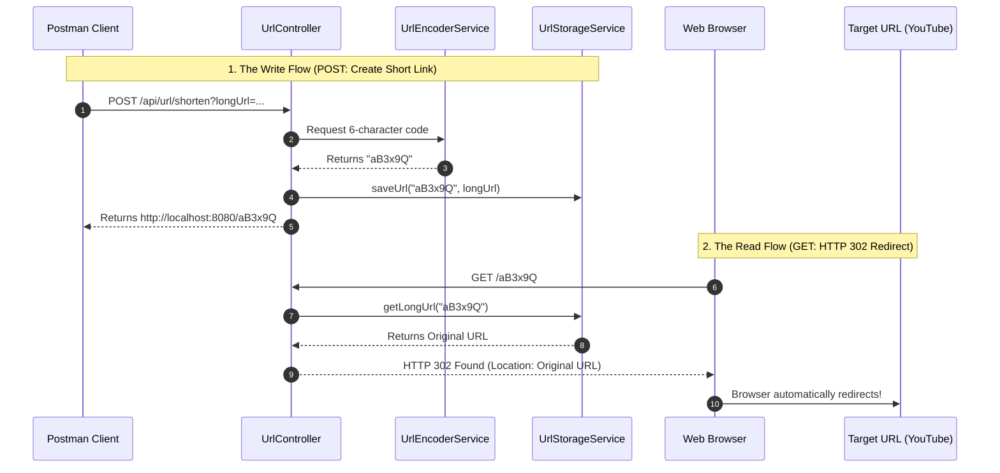

# 🔗 Day 4: The Mini-Bitly (URL Shortener)

> **Core Concept:** Building a URL shortening service using Base62 encoding and HTTP 302 Redirects.
> **Constraint:** Strict "No-AI" coding policy. Built entirely from scratch using raw Java and Spring Boot.


---

## ❓ The What and The Why

* **What is it?** A service that takes a long, cumbersome URL, converts it into a short 6-character alias, and automatically redirects users who click the alias to the original destination.
* **Why build it?** URL Shorteners are a classic System Design interview question. Building one demonstrates a strong understanding of hashing algorithms (Base62), data mapping, and HTTP status codes (specifically `302 Found` for redirection).

---


---
## System Design: Mini-Bitly (URL Shortener)

Building a URL shortener is a classic system design challenge that demonstrates a strong grasp of scalable architectures, caching, and database design.

### 1. The Core Algorithm: Base62 Encoding
You cannot simply assign a random number to a URL because numbers get too long quickly. Industry-standard shorteners use **Base62 encoding** (0-9, a-z, A-Z).

* **Why it matters:** With just a 7-character Base62 string (e.g., `bit.ly/3kFj2x`), you can generate over **3.5 trillion** unique URLs.
* **The Implementation:** Create an auto-incrementing ID in the database for every new long URL, then pass that numeric ID through a Base62 conversion algorithm to generate the short string.

### 2. The HTTP Redirect: 301 vs. 302
When a user clicks the short link, the API intercepts it and sends the browser to the original destination using HTTP status codes.

* **301 (Moved Permanently):** The browser caches the redirect. Future clicks go straight to the long URL without hitting the server.
    * *Pros:* Reduces server load.
    * *Cons:* Cannot track analytics/clicks.
* **302 (Found / Moved Temporarily):** The browser does not cache the redirect. Every click hits the server first.
    * *Pros:* Perfect for tracking analytics.
    * *Cons:* Heavier load on the system.

### 3. Database Selection & The "Collision" Problem
If you use a random string generator, two different long URLs might accidentally get the exact same short URL (a collision).

* **The Relational Approach (PostgreSQL/MySQL):** Rely on the database's built-in `AUTO_INCREMENT` or `SEQUENCE` to guarantee every URL gets a unique, sequential numeric ID *before* converting it to Base62.
* **The NoSQL Approach (MongoDB):** Highly scalable, but generating sequential IDs in a distributed environment requires a standalone "Ticket Server" or an algorithm like Snowflake ID to guarantee uniqueness.

### 4. High-Performance Caching (The Redis Flex)
URL shorteners are incredibly **read-heavy** (e.g., 1 creation vs. 100,000 clicks). Querying the main database for every click will cause it to crash under heavy traffic.

* **The Fix:** Implement the **Cache-Aside pattern** using Redis. When a short link is clicked, the API checks Redis first. If found, it redirects instantly. If not, it checks the DB, saves the mapping to Redis, and then redirects.

### 5. Spring Boot Application Structure
To keep the codebase clean, modular, and industry-aligned:

* **`RedirectController`:** Handles the incoming clicks (`@GetMapping("/{shortUrl}")`) and returns the 301/302 response.
* **`LinkService`:** Contains the business logic and the Base62 encoding/decoding math.
* **`LinkRepository`:** Communicates with the database to save and fetch the URL mappings.# System Design: Mini-Bitly (URL Shortener)

---

## URL Shortener System Design: Base62, Distributed IDs, & Randomization

When building a highly scalable URL shortener, the central challenge is efficiently generating unique short strings without creating database bottlenecks. Below is the complete technical breakdown of the mathematical algorithms and distributed architectural patterns used in production environments.

---

## Part 1: The Base62 Core Logic

Instead of exposing raw database IDs (which get too long and are easily guessable), we convert sequential numeric IDs into Base62 strings. Base62 uses 62 characters (`a-z`, `A-Z`, `0-9`).

### The Production-Ready Java Implementation
```java
import org.springframework.stereotype.Service;

@Service
public class Base62Encoder {

    private static final String ALPHABET = "0123456789abcdefghijklmnopqrstuvwxyzABCDEFGHIJKLMNOPQRSTUVWXYZ";
    private static final int BASE = ALPHABET.length();

    public String encode(long id) {
        // Edge Case: ID is 0. 
        if (id == 0) {
            return String.valueOf(ALPHABET.charAt(0));
        }

        StringBuilder shortUrl = new StringBuilder();

        while (id > 0) {
            int remainder = (int) (id % BASE);
            shortUrl.append(ALPHABET.charAt(remainder));
            id /= BASE;
        }

        // Must reverse because the math calculates from least significant to most significant
        return shortUrl.reverse().toString();
    }

    public long decode(String shortUrl) {
        long id = 0;
        for (int i = 0; i < shortUrl.length(); i++) {
            int charValue = ALPHABET.indexOf(shortUrl.charAt(i));
            // Edge Case Handling: Invalid character in URL
            if (charValue == -1) {
                throw new IllegalArgumentException("Invalid Base62 character found");
            }
            id = (id * BASE) + charValue;
        }
        return id;
    }
}
```
### The Math Walkthrough

**1. Encoding (Database ID -> Short Link)**
Assume the database generates the ID 10000.

* `10000 % 62 = 18` -> Maps to `i`
* `10000 / 62 = 161`
* `161 % 62 = 37` -> Maps to `B`
* `161 / 62 = 2`
* `2 % 62 = 2` -> Maps to `2`
* `2 / 62 = 0` (Loop ends)

Result built: `iB2`. Reversed: **`2Bi`**.

**2. Decoding (Short Link -> Database ID)**
A user clicks `/2Bi`.

* Start with `id = 0`
* Read `2`: `(0 * 62) + 2 = 2`
* Read `B`: `(2 * 62) + 37 = 161`
* Read `i`: `(161 * 62) + 18 = 10000`

Result: **10000**. The system queries the DB for ID 10000.

---

### Part 2: Distributed System Architectures (No Centralized ID Generator)

If your system scales to thousands of requests per second across multiple API servers, a single database `AUTO_INCREMENT` column will lock and crash. You must distribute the ID generation.

#### Architecture 1: The Hash & Truncate Approach (Abandoning IDs)
Instead of IDs, pass the long URL through a cryptographic hash.

* **How it works:** Hash the URL using MD5 or SHA-256. This generates a massive string. Truncate it to the first 7 characters.
* **Pros:** Totally stateless. No central ID server needed.
* **Cons/Edge Cases (Collisions):** Two different URLs will eventually hash to the same first 7 characters.
* **The Solution:** Before saving, check the database. If a collision occurs, append a predefined salt or a random counter to the original URL (e.g., `url + "[SALT_1]"`), re-hash it, and try again.

#### Architecture 2: Twitter Snowflake Algorithm
Servers generate completely unique 64-bit numbers in their own RAM instantly.

* **How it works:** The 64 bits are divided:
  * **1 bit:** Sign bit (always 0).
  * **41 bits:** Timestamp (Milliseconds since a custom epoch, lasts ~69 years).
  * **10 bits:** Machine/Worker ID (Allows up to 1024 distinct servers).
  * **12 bits:** Sequence Number (Allows 4096 IDs per server, per millisecond).
* **Pros:** Extremely fast. Sortable by time. Zero database communication required.
* **Cons/Edge Cases (NTP Clock Drift):** If a server's internal clock somehow syncs backward in time, it could generate duplicate IDs.
* **The Solution:** The server must cache its last timestamp. If the current time is behind the last timestamp, the server must refuse to generate IDs until the clock catches up.

#### Architecture 3: ZooKeeper / Redis Ticket Server (Range Allocation)
A hybrid approach utilizing a centralized node that only communicates rarely.

* **How it works:** A central server (ZooKeeper) hands out "ranges" of IDs to API servers. API Server A requests a batch and is given `1 to 100,000`. Server B is given `100,001 to 200,000`. The API servers now generate IDs safely in memory without talking to the database.
* **Pros:** High performance, avoids database locking.
* **Cons/Edge Cases (Server Crashes):** If Server A crashes after using only 500 IDs, the remaining 99,500 IDs in its batch are permanently lost.
* **The Solution:** This is generally an acceptable trade-off in URL shorteners, as missing IDs do not break the Base62 logic.

---

### Part 3: The Randomized Approach

Instead of math conversions or distributed tokens, the system simply generates a random 7-character string.

#### The Implementation Logic
Generate a string using `java.security.SecureRandom` (never `Math.random()`, as it is cryptographically predictable).

#### The System Flow & Edge Cases
1. **Generate:** Create a random 7-character Base62 string.
2. **Read-Before-Write Penalty:** Query the DB: `SELECT count(1) FROM urls WHERE short = 'randomX'`.
3. **Retry Loop:** If it exists, loop back to step 1.

#### Pros and Cons
* **Pros:** Simplest to build. Highly secure (users cannot guess `link/101` if they have `link/100` because there is no sequential pattern).
* **Cons:** Performance degrades over time. As the database fills up, the chance of collisions rises exponentially, requiring more retries and database reads per request.

#### The Production Solution for Randomization
* **Database Indexing:** You must place a Unique Index on the `short_url` database column. This turns the collision check from a full-table scan (which takes seconds) into an instant `O(1)` or `O(log N)` lookup.
* **Max Retry Limits:** Never write a `while(true)` loop. Always set a max retry limit (e.g., `int retries = 0; while(retries < 5)`). If it fails 5 times, throw an HTTP 500 exception rather than infinitely locking the server thread.

---

## 🧠 System Architecture & Data Flow

This diagram illustrates the timeline of the two distinct data flows: the internal creation of the short code, and the external HTTP 302 redirect.


---

## 🏗️ Phase 1: The Base62 Encoder

**Objective:** Create the algorithm responsible for generating the 6-character short code.

### Step 1: The Base62 Character Set
* Defined a constant string containing all 62 alphanumeric characters (`a-z`, `A-Z`, `0-9`). This ensures our URLs are URL-safe and don't contain special characters that could break a browser link.

### Step 2: The Generator Logic (`UrlEncoderService.java`)
* Created a `@Service` that acts as the core mathematical engine.
* Implemented an `encode()` method that generates a random 6-character string from the Base62 character set.
* *Note on Distributed Architecture:* In a massive enterprise system, this random generation could cause a collision (generating the same code twice). A true production system would use a centralized ID generator (like Apache Zookeeper or Twitter Snowflake) and convert the base-10 ID to a base-62 string.
---
## 🗄️ Phase 2: The Storage Engine

**Objective:** Securely map the 6-character short codes to the original long URLs in memory so the system can instantly look them up during a redirect.

### Step 1: The Thread-Safe Database (`UrlStorageService.java`)
* **What:** Created a dedicated `@Service` layer to act as the internal database.
* **Why:** We used a `ConcurrentHashMap<String, String>` to store the mappings. The `Key` is the 6-character Base62 string, and the `Value` is the original long URL. `ConcurrentHashMap` guarantees thread safety, meaning hundreds of users can generate short links concurrently without corrupting the server's memory.

### Step 2: Read and Write Operations
* **The Put Operation:** When a new short link is generated, the service maps the short code to the long URL.
* **The Get Operation (O(1) Time Complexity):** When a user clicks a short link, the system must figure out where to send them instantly. Because we are using a Hash Map, looking up the long URL takes **O(1)** time, guaranteeing lightning-fast redirects regardless of how many millions of links are stored in the system.
---
## 🚀 Phase 3: The Redirect API (Producer & Consumer)

**Objective:** Build the REST endpoints to generate short links and intercept web traffic to perform HTTP 302 redirects.

### Step 1: The Generation Endpoint (POST)
* **What:** Created a `POST /api/url/shorten` endpoint.
* **How it works:** It accepts a massive `longUrl`, passes it to the `UrlEncoderService` to generate a 6-character Base62 string, and saves the mapping in the `UrlStorageService`. It then constructs and returns the final shortened URL (e.g., `http://localhost:8080/aB3x9Q`) to the client.

### Step 2: The Redirect Endpoint (GET)
* **What:** Created a root-level `GET /{shortCode}` endpoint. This acts as the traffic cop.
* **How it works:** When a user pastes the short link into their browser, this endpoint intercepts the request. It looks up the 6-character code in the `UrlStorageService`. If the original URL is found, the server responds with an **HTTP 302 Found** status code.
* **Why HTTP 302 instead of 301?** * `301 Moved Permanently`: The browser caches the redirect forever. The user's browser will never hit our server again, making it impossible to track click analytics.
  * `302 Found (Temporary Redirect)`: Forces the browser to ping our server *every single time* the link is clicked before redirecting. This is how real URL shorteners track how many times a link was clicked.

---

### The Magic Behind the Redirect

This single line of code is the engine of your URL shortener. It forces the user's web browser to leave your short link and immediately jump to the original destination.

`return ResponseEntity.status(HttpStatus.FOUND).location(URI.create(longUrl)).build();`

Here is the exact breakdown of what this Spring Boot code is doing under the hood:

**1. `ResponseEntity` (The HTTP Package)**
In Spring Boot, `ResponseEntity` represents the entire HTTP response you are sending back to the user's browser. It allows you to manually craft the status code, the headers, and the body of the network package the browser will receive.

**2. `.status(HttpStatus.FOUND)` (The 302 Redirect)**
`HttpStatus.FOUND` is Spring Boot's enum for the **HTTP 302** status code.
* When a browser sees a `200 OK`, it stays on the page and renders the HTML.
* When a browser sees a `302 FOUND`, it immediately stops what it is doing and prepares to jump to a new web page.
* *(System Design Note: 302 is a "Temporary" redirect. This means the browser does not cache the result, forcing it to hit your Spring Boot server every single time the user clicks the link. This is how you track click analytics!)*

**3. `.location(URI.create(longUrl))` (The Destination)**
A 302 status code is useless if you don't tell the browser *where* to go.
* The `.location()` method injects a specific HTTP Header called the **`Location` header** into your response.
* `URI.create(longUrl)` safely parses your raw String (e.g., `"https://github.com/your-profile"`) into a formatted Java URI object that the network protocol understands.

**4. `.build()` (Ship It)**
Because a redirect doesn't need a JSON body or an HTML page (the user won't be on your site long enough to see it), `.build()` simply finalizes the response with an empty body and ships it out.

---

### What the Browser Actually Sees

When your Spring Boot app executes that line of code, this is the raw text that is blasted over the internet back to the user's browser:

```http
HTTP/1.1 302 Found
Location: [https://github.com/your-profile](https://github.com/your-profile)
Content-Length: 0
```
---
## 🧪 How to Test Locally

To test the full lifecycle of the URL shortener, you need both an API client (like Postman) and a standard web browser.

### 1. Generate the Short Link (Postman)
* Start the Spring Boot application.
* Open Postman and create a **POST** request.
* Enter the URL: `http://localhost:8080/api/url/shorten?longUrl=https://www.youtube.com/watch?v=dQw4w9WgXcQ`
* Hit **Send**.
* **Expected Result:** The server returns a `200 OK` with your new shortened link (e.g., `http://localhost:8080/aB3x9Q`).

### 2. Test the Redirect (Web Browser)
* Copy the generated short link from Postman (ensure you do not copy any surrounding quotation marks).
* Open Chrome, Edge, or Safari.
* Paste the short link into the URL bar and hit **Enter**.
* **Expected Result:** The browser sends a `GET` request to your server. The server intercepts it, responds with an `HTTP 302 Found`, and instantly redirects your browser to the YouTube video.

---

## 🐛 Bug Log & Lessons Learned

During development, I encountered and resolved several critical Spring Boot routing and data-binding bugs. Documenting these serves as a great reference for how strict the Spring framework is regarding HTTP methods and variable names.

### 1. The `@RequestBody` vs `@PathVariable` Trap
* **The Bug:** The GET endpoint was returning a `404 Not Found` or failing to trigger.
* **The Cause:** I initially used `@RequestBody String shortCode` to try and capture the URL parameter. However, `GET` requests do not have a request body. 
* **The Solution:** Switched to `@PathVariable String shortCode` so Spring Boot knew to extract the variable directly from the URL path (`/{shortCode}`).

### 2. The Case-Sensitivity Crash (500 Internal Server Error)
* **The Bug:** The server threw a `MissingPathVariableException`, crashing the request.
* **The Cause:** Spring Boot's variable binding is strictly case-sensitive. The route was mapped as `/{shortCode}` (capital C), but the method parameter was `String shortcode` (lowercase c). Because they didn't match perfectly, Spring panicked.
* **The Solution:** Explicitly mapped the variable by updating the annotation to `@PathVariable("shortCode") String shortCode`. This guarantees Spring binds the URL path to the Java variable regardless of minor naming differences.

### 3. The Dirty Data Crash (`URI.create` Exception)
* **The Bug:** Testing the redirect caused the server to crash if the Postman input had hidden spaces.
* **The Cause:** `URI.create()` is extremely strict. If a URL string has a leading space (e.g., ` https://google.com`), Java throws an `IllegalArgumentException`.
* **The Solution:** Added a data-sanitization layer before executing the redirect: `longUrl.trim().replace("\"", "")`. This strips out any accidental whitespace or rogue JSON quotes passed in from the client.

---

## ⚠️ Edge Cases & Production Readiness

While this Mini-Bitly implementation successfully demonstrates the core mechanics of URL shortening and HTTP 302 redirects, running this in a production environment introduces several massive system design challenges. Here is how we would scale this for millions of users:

### 1. The Collision Problem (Data Overwrite)
* **The Edge Case:** We are using `Random.nextInt()` to generate the 6-character string. If the randomizer accidentally generates the code `aB3x9Q` for User A, and then generates `aB3x9Q` again for User B, User A's long URL is permanently overwritten in the `ConcurrentHashMap`.
* **The Solution:** We must eliminate randomness. Production systems use a centralized **Counter** or a distributed ID generator like **Twitter Snowflake** to generate a unique base-10 integer (e.g., `1000001`), and then mathematically convert that exact integer into a Base62 string. This guarantees 100% collision-free URLs.

### 2. The Memory Exhaustion Crash (Volatile Storage)
* **The Edge Case:** Just like our Day 3 Cache, `ConcurrentHashMap` stores everything in RAM. If we generate 50 million short links, the server will run out of memory and crash. Furthermore, if the server restarts, every single short link we ever created is instantly deleted.
* **The Solution:** The `ConcurrentHashMap` must be replaced with a persistent, highly available database. We would use a NoSQL database like **MongoDB** or **Cassandra** to permanently store the URL mappings, and put a **Redis Cache** in front of it to keep the redirects lightning fast.

### 3. Malicious Links & SSRF Attacks
* **The Edge Case:** Right now, the API accepts *anything* as a long URL. A malicious user could pass in a script (`javascript:alert(1)`), a phishing site, or an internal server IP (`http://192.168.1.1`), turning our service into a weapon.
* **The Solution:** Implement strict input validation. The `POST` endpoint must use Regex to verify the input is a valid HTTP/HTTPS web address. In a true enterprise system, we would also run the URL against an external security service like the **Google Safe Browsing API** before allowing it to be shortened.

### 4. The Analytics Bottleneck
* **The Edge Case:** We used a `302 Found` redirect so we could track every time a user clicks a link. However, if a celebrity tweets our short link and it gets clicked 100,000 times a second, attempting to write those click analytics to a database synchronously will freeze the redirect engine.
* **The Solution:** We must decouple the redirect from the analytics. When the `GET` request is hit, we immediately issue the 302 redirect to the user, but we fire a background event into a message broker (like **Apache Kafka** - similar to our Day 2 project) to asynchronously update the click counters without slowing down the user's browser.
---

## 🔮 Future Enhancements

If I were to expand this specific 3-hour codebase, I would add:
1. **Custom Aliases:** Allow users to pass an optional `customAlias` parameter in the POST request (e.g., `localhost:8080/my-portfolio`). The system would check if it's available and save it directly instead of generating a random Base62 string.
2. **Link Expiration (TTL):** Integrate the concepts from my Day 3 project to allow users to set an expiration date on their short links (e.g., "Delete this link after 24 hours").
3. **Click Analytics Endpoint:** Add a `GET /api/url/stats/{shortCode}` endpoint that returns a JSON payload showing how many times a specific link was clicked, when it was created, and when it was last accessed.

---

## 🛑 The "No Time Constraint" Architecture

If I were building this without a 3-hour time constraint, I would architect a globally distributed, highly available URL shortener capable of handling thousands of redirects per second. Here is the real-world enterprise design:

1. **Distributed ID Generation (Twitter Snowflake)**
   Instead of generating random strings (which causes collisions), I would deploy a dedicated ID Generation service using **Apache Zookeeper** or the **Twitter Snowflake** algorithm. This service would generate a strictly unique, incremental 64-bit integer for every new request. The API would then mathematically convert that exact integer into a Base62 string, guaranteeing 100% collision-free URLs globally.

2. **NoSQL Persistence & Redis Caching**
   I would swap the volatile `ConcurrentHashMap` for a globally replicated NoSQL database like **Apache Cassandra** or **Amazon DynamoDB**. Because URL shortening is extremely read-heavy (100 redirects for every 1 link created), I would place a **Redis** cluster in front of the database. When a user clicks a link, the API checks Redis first (sub-millisecond latency). If there is a cache miss, it queries DynamoDB and updates the cache.

3. **Asynchronous Analytics Pipeline (Kafka)**
   To prevent the `GET` redirect from slowing down while trying to update click counters in a database, I would implement an event-driven architecture. The API would instantly issue the `302 Found` redirect to the user's browser, and simultaneously fire a lightweight "Click Event" into an **Apache Kafka** topic. A separate background microservice would consume that Kafka stream and bulk-update the analytics database.

4. **Rate Limiting & Abuse Prevention**
   I would integrate my Day 1 Rate Limiter at the API Gateway level to prevent malicious bots from spamming the `POST` endpoint and exhausting our Base62 namespace.