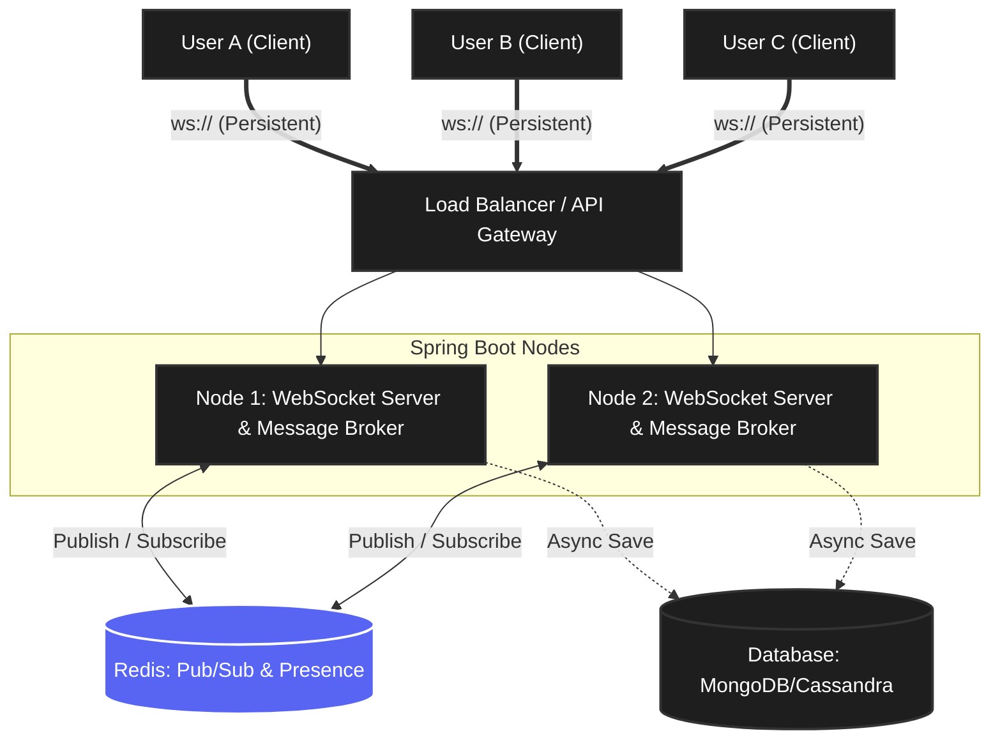
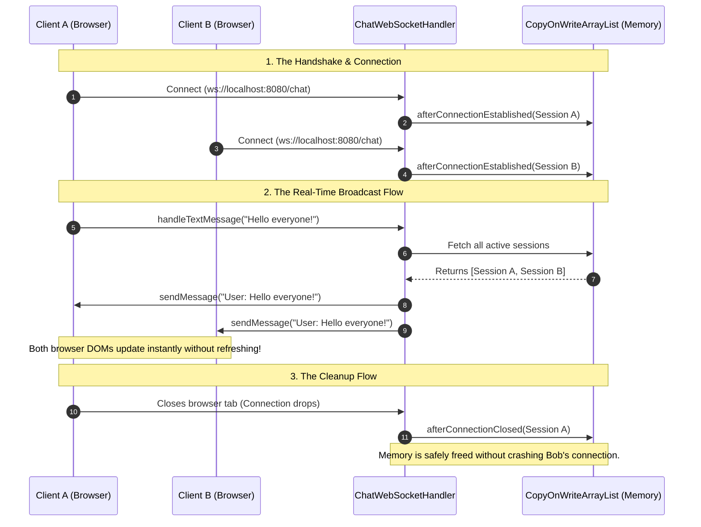

# 💬 Day 5: The Mini-Discord (WebSocket Chat Engine)

> **Core Concept:** Building a real-time, bidirectional chat server using WebSockets.
> **Constraint:** Strict "No-AI" coding policy. Built from scratch using Spring Boot WebSockets and Vanilla JavaScript.


---

## ❓ The What and The Why

* **What is it?** A real-time chat engine that allows multiple clients to connect to a single server and instantly broadcast messages to each other without refreshing the page.
* **Why build it?** Traditional HTTP is stateless (Request $\rightarrow$ Response $\rightarrow$ Disconnect). System design interviews for top-tier roles frequently test your ability to design stateful, real-time architectures (like chat apps, live sports tickers, or collaborative document editing). WebSockets are the industry standard for keeping a persistent, bidirectional pipe open between a client and a server.

---

## System Design: Mini-Discord (Real-Time WebSocket Engine)

Standard REST APIs are terrible for real-time chat. If you use HTTP, the client has to constantly ask the server, *"Any new messages? How about now? Now?"* (This is called Long-Polling, and it destroys server resources).

To build a Discord clone, you must drop HTTP and use **WebSockets**.


### 1. The Core Concept: The Persistent Connection
Unlike HTTP, which is stateless and instantly disconnects after a response, a WebSocket is a **persistent, full-duplex TCP connection**.
* **The Handshake:** The client sends a standard HTTP `GET` request to the server with a special header: `Connection: Upgrade`.
* **The Shift:** The Spring Boot server agrees, upgrades the protocol from HTTP to `ws://`, and keeps the pipeline open.
* **The Result:** Now, the server doesn't have to wait to be asked. The exact millisecond User A sends a message, the server can actively push that message down the pipe to User B.

### The "Split Path" Architecture (How Discord Really Works)

When you send a message to a Discord channel, it does not just go to the database and wait. Your Spring Boot server actually acts as a traffic router and sends your message in two completely different directions simultaneously.

#### Path 1: The Database (For the Offline Users)
You are completely right that the data needs to be stored.
* The exact millisecond your server receives the message, it saves it to the Database (Discord uses a massive database called Cassandra).
* **Why?** This is strictly for permanent history and for users who are currently offline.

#### Path 2: The WebSocket Push (For the Online Users)
The server does **not** wait for the database to finish saving.
* At the exact same time it sends the data to the database, it also takes a copy of your message and pushes it directly down the WebSocket pipes of everyone who is currently online and looking at that channel.
* **Why?** Databases are relatively slow. Reading from RAM and pushing through a TCP WebSocket pipe is nearly instant. This is why you see your friend's message pop up the millisecond they hit "Enter."

---

### The "Coming Online" Scenario (The Catch-Up Phase)

You asked: *"When a user gets online, do they get that data updated from the store?"*

**Yes, absolutely!** But it happens in a very specific, two-step process.

Imagine User B has been offline for 3 hours. During that time, 50 messages were sent to the channel (and saved to the database via Path 1).

Here is exactly what happens when User B opens the Discord app:

**Step 1: The HTTP History Fetch (The Loading Screen)**
* Before User B even connects to the real-time WebSocket, their app makes a standard, old-school HTTP REST request: `GET /api/channels/123/messages?limit=50`.
* The server goes to the Database, grabs the missed messages, and sends them back.
* *This is why when you open Discord on your phone, you sometimes see a gray loading spinner for a second before the old messages populate.*

**Step 2: The WebSocket Connection (The Live Feed)**
* Once the app has caught up on the history, it says, *"Okay, I'm up to date."* * It then opens the persistent WebSocket connection (`ws://`) to the server.
* From this point forward, the app stops asking the database for updates. It just sits quietly, waiting for the server to actively push new messages down the pipe (Path 2).
---
### 2. STOMP: The Language of the Pipe
Raw WebSockets are just an empty pipe. If you send a message down the pipe, Spring Boot doesn't know who it's from, who it's for, or what room it belongs to.
To fix this, we use a sub-protocol called **STOMP (Simple Text Oriented Messaging Protocol)**.

* **Why it matters:** STOMP gives WebSockets a structure that looks exactly like HTTP endpoints.
* **How it works in Spring:** Instead of `@GetMapping("/chat")`, you use `@MessageMapping("/chat.sendMessage")`. It allows you to route messages to specific "Topics" (like a Discord channel) or specific "Queues" (like a Discord Direct Message).

To build a Mini-Discord, you need to understand how STOMP wraps your raw data into "Frames." A STOMP frame looks remarkably similar to an HTTP request: it has a **Command**, **Headers**, and a **Body**.

### The Anatomy of a STOMP Frame
When User A types a message in a Discord channel, their app doesn't just send the text. It sends a structured STOMP frame that looks like this:

```stomp
SEND
destination:/app/chat.send
content-type:application/json

{"channelId": "general", "sender": "Rohan", "text": "Hello team!"}
^@
```
### How STOMP Maps to Discord Features

To make your Mini-Discord work, your Spring Boot Message Broker divides network traffic into two distinct patterns: **Topics** (Pub/Sub) and **Queues** (Point-to-Point).


#### 1. Discord Server Channels (The Pub/Sub "Topic")
When you click on a server channel in Discord like `#java-help`, you are not fetching data; you are **Subscribing**.

* **The Action:** User A and User B both click on `#java-help`.
* **The STOMP Frame:** Their browsers send a `SUBSCRIBE` frame to the destination `/topic/java-help`.
* **The Broker:** The Spring Boot Message Broker notes that both users are now actively listening to this destination.
* **The Broadcast:** When User C sends a message tagged for `/topic/java-help`, the Message Broker instantly duplicates the message and fires it down the pipes of both User A and User B.

#### 2. Discord Direct Messages (The Point-to-Point "Queue")
If you want to send a private DM to a friend, you cannot broadcast it to a public `/topic`. You need a private channel.

* **The Action:** User A wants to send a private message to User B (whose ID is `user-123`).
* **The STOMP Destination:** Spring Boot uses a special prefix for private messages called `/queue`. User B's app automatically sends a `SUBSCRIBE` frame to `/user/user-123/queue/messages` the moment they log in.
* **The Routing:** When User A sends a DM, they send it to the server. The server explicitly routes that single STOMP frame only to the specific private queue owned by `user-123`. No one else can hear it.

#### 3. Discord Slash Commands (The App Endpoint)
When you type `/kick @user` in Discord, you aren't broadcasting a message to your friends. You are asking the server to run business logic.

* **The Action:** User types a command.
* **The STOMP Destination:** The frontend routes this to `/app/commands.kick`.
* **The Controller:** Just like an HTTP `@PostMapping`, Spring Boot catches this using a `@MessageMapping("/commands.kick")` annotation. It executes the Java logic (checking admin roles, kicking the user), and then it might send a system message to the `/topic/general` saying *"User was kicked."*

---

### Why this Architecture is Bulletproof
By using STOMP instead of raw WebSockets, you get to write Spring Boot controllers that look exactly like standard REST APIs.

* You don't have to write complex `if/else` statements parsing raw text strings to figure out where messages should go.
* Spring Boot's built-in `SimpMessagingTemplate` handles all the complex routing, copying, and broadcasting for you based purely on the STOMP `destination` header.

### 3. The Message Broker (The Traffic Cop)
When User A sends a message to the `#general` channel, who is responsible for distributing that message to the 500 other users looking at that channel? **The Message Broker.**

* **The Simple Broker (In-Memory):** Spring Boot comes with a built-in, in-memory broker. It handles all the routing and topic subscriptions automatically. (Perfect for local testing).
* **The Enterprise Broker (RabbitMQ):** If your app gets big, the in-memory broker will choke. Spring Boot allows you to seamlessly swap out the simple broker for a heavy-duty RabbitMQ instance to handle millions of real-time messages.

In a WebSocket/STOMP architecture, the Message Broker is a dedicated engine responsible for exactly two things:
1. **Holding State:** Remembering exactly which users are currently subscribed to which channels (e.g., User A and B are in `#general`, User C is in `#java-help`).
2. **Fanning Out (Broadcasting):** Taking a single incoming message, copying it, and pushing it down the private WebSocket pipes of every subscribed user.

---

### The Two Types of Brokers

When building your Mini-Discord, you have to choose which engine to use based on your scale.

#### 1. The Simple Broker (Built-in / In-Memory)
Spring Boot comes with a lightweight broker out of the box.
* **How it works:** It stores all the channel subscriptions and routing logic directly inside the RAM of your JVM (Java Virtual Machine).
* **When to use it:** Local development and small portfolio projects.
* **The Fatal Flaw:** It is not scalable. If you run two Spring Boot servers, the Simple Broker on Server 1 cannot see the Simple Broker on Server 2. A message sent on Server 1 will never reach users connected to Server 2.

#### 2. The Enterprise Broker (RabbitMQ / ActiveMQ)
For a true production app, you disable the Simple Broker and tell Spring Boot to use a **StompBrokerRelay**.
* **How it works:** Spring Boot connects to an external, standalone messaging server (like RabbitMQ) over a persistent TCP connection.
* **The Architecture:** Now, your Spring Boot app doesn't do *any* broadcasting. When a message comes in, Spring Boot blindly hands it to RabbitMQ. RabbitMQ is a distributed powerhouse designed to handle millions of concurrent routing rules across multiple servers.

---

### How the Broker Routes Traffic (The Two Paths)

When a user sends a STOMP message, Spring Boot looks at the `destination` header (the URL) to decide if your Java code needs to see it, or if it should go straight to the Broker.

You configure these prefixes in your `WebSocketConfig`.

#### Path A: Straight to the Broker (e.g., `/topic/...`)
If a user just wants to send a standard text message to the `#general` channel, they don't need to trigger any complex Java database logic first.
1. The client sends a message to `/topic/general`.
2. Spring Boot sees the `/topic` prefix.
3. It bypasses your `@Controller` completely and hands the message **directly to the Message Broker**.
4. The Broker instantly blasts it out to everyone subscribed to `#general`.
   *(Fast, but you cannot save the message to a database this way).*

#### Path B: Through the Controller First (e.g., `/app/...`)
If a user sends a message that *must* be saved to a database, or triggers a command (like `/kick`), it must hit your Java code first.
1. The client sends a message to `/app/chat.send`.
2. Spring Boot sees the `/app` prefix and routes it to your `@MessageMapping("/chat.send")` method in your Java controller.
3. Your Java code executes (e.g., saving the message to MongoDB, validating the user).
4. **The Handoff:** Your controller then returns the message (often using the `@SendTo("/topic/general")` annotation).
5. Spring Boot takes that returned message and passes it to the **Message Broker**.
6. The Broker blasts it out to everyone subscribed to `#general`.

### Summary
The Message Broker is the ultimate middleman. It frees up your Spring Boot application from having to manually loop through thousands of TCP connections just to send a text message.

---

### 4. The System Design Trap: The Multi-Server Problem
If you scale your app and run two Spring Boot servers behind a Load Balancer, WebSockets create a massive architectural problem.

* **The Problem:** User A connects to **Server 1**. User B connects to **Server 2**. User A sends a message to User B. Server 1 looks at its local WebSocket connections, doesn't see User B, and drops the message. The users cannot talk to each other!
* **The Solution (Pub/Sub):** You must introduce a centralized Pub/Sub engine, usually **Redis**.
    1. Server 1 receives the message from User A.
    2. Server 1 publishes the message to the Redis central channel.
    3. Server 2 is subscribed to Redis, sees the message, and pushes it down the WebSocket pipe to User B.

### Real-Time Data Flow (Sequence Diagram)

This sequence diagram maps the exact millisecond-by-millisecond flow of a message traveling from one user, through the distributed backend, and out to a user on an entirely different server.

```mermaid
sequenceDiagram
    autonumber
    
    actor Alice
    participant Node1 as Spring Boot (Node 1)
    participant DB as Database
    participant Redis as Redis (Pub/Sub)
    participant Node2 as Spring Boot (Node 2)
    actor Bob

    Note over Bob, Node2: Bob is connected to Node 2
    Bob->>Node2: STOMP SUBSCRIBE: /topic/general
    
    Note over Alice, Node1: Alice is connected to Node 1
    Alice->>Node1: STOMP SEND: /app/chat.send <br/> {channel: "general", text: "Hi!"}

    rect rgb(40, 44, 52)
    Note right of Node1: The Split Path Architecture
    Node1->>DB: 1. Async Save (Message History)
    Node1->>Redis: 2. PUBLISH to 'channel_events'
    end

    Redis-->>Node2: Broadcasts Message Payload
    
    Note right of Node2: Broker checks local subscribers
    Node2->>Bob: STOMP MESSAGE: /topic/general <br/> {sender: "Alice", text: "Hi!"}
```



### Flow Description & Required Requests

**1. The Subscription Phase (Bob)**
* **Action:** Bob clicks on the `#general` channel.
* **Request:** His client sends a STOMP `SUBSCRIBE` frame to `/topic/general`.
* **Result:** Node 2's internal Message Broker registers that Bob's specific WebSocket session needs to receive anything tagged for that destination.

**2. The Inbound Message (Alice)**
* **Action:** Alice types "Hi!" and hits enter.
* **Request:** Her client sends a STOMP `SEND` frame to the application endpoint `/app/chat.send`.
* **Result:** Node 1's `@MessageMapping` controller intercepts this payload to execute Java business logic.

**3. The Split Path (Processing)**
* Node 1 immediately performs an asynchronous write to the Database to permanently store the chat history.
* Simultaneously, Node 1 takes the fully formed message object and uses a `RedisTemplate` to `PUBLISH` it to a global Redis topic called `channel_events`.

**4. The Fan-Out (Redis to Node 2)**
* Node 2 has a `RedisMessageListener` constantly watching the `channel_events` topic.
* Node 2 instantly receives Alice's message from Redis.

**5. The Outbound Delivery (Node 2 to Bob)**
* Node 2 takes the message it got from Redis and passes it to its internal Message Broker.
* The Broker sees the message is meant for `/topic/general`, iterates through its local active connections, finds Bob, and pushes the data down his specific WebSocket pipe.

---

While opening a WebSocket pipe and broadcasting messages is the first step, a true "Mini-Discord" must solve three major architectural challenges: Authentication over a stateful protocol, real-time Presence (Online/Offline status), and Message Persistence.

Here is the technical perspective on how industry-standard chat applications solve these problems.

---

### 1. The Authentication Trap (How do you secure a WebSocket?)

**The Problem:** In a standard REST API, your React or Next.js frontend sends a JWT (JSON Web Token) inside the `Authorization: Bearer <token>` HTTP header with every request. However, the standard browser WebSocket API *does not allow you to append custom HTTP headers* during the initial handshake.

**The Industry Solutions:**

* **Approach A: The URL Query Parameter (Simple but risky)**
  * *How it works:* The frontend attaches the token to the URL: `ws://api.domain.com/chat?token=eyJhbG...`
  * *The Danger:* URLs are often logged by intermediate proxies, load balancers (like AWS ALB), and server logs, exposing the user's secure token in plain text.
* **Approach B: The STOMP Header Interceptor (The Spring Boot Standard)**
  * *How it works:* The initial HTTP to WebSocket handshake happens completely anonymously. However, before the user is allowed to subscribe to any channels (like `/topic/general`), the STOMP protocol sends a `CONNECT` frame. The frontend injects the JWT into *this* specific frame.
  * *The Implementation:* In Spring Boot, you create a `ChannelInterceptor`. This intercepts the incoming `CONNECT` frame, extracts the JWT, validates it, and manually sets the `java.security.Principal` (the authenticated user) for that specific WebSocket session. If the token is invalid, the server immediately severs the TCP connection.


---

### 2. Presence & Heartbeats (The "Who's Online?" Problem)

**The Problem:** How does Discord instantly know when your internet drops so it can gray out your profile picture? TCP connections can "ghost" drop—meaning the user's WiFi disconnected, but the server hasn't realized the pipe is broken yet.

**The Industry Solution: Ping/Pong & Redis Sets**

* **Heartbeats (Ping/Pong):** The WebSocket protocol has built-in control frames. The Spring Boot server sends a tiny empty message (a "Ping") to the client every 10 seconds. The client must instantly reply with a "Pong". If the server misses two Pongs in a row, it assumes the user is dead and aggressively closes the connection to free up RAM.
* **Global Presence State (Redis):** If you have 5 Spring Boot servers running your chat app, Server A doesn't know who is connected to Server B.
  * When a user connects, Spring Boot fires a `SessionConnectEvent`. Your code catches this and adds the User ID to a **Redis Set** called `online_users`.
  * When a user disconnects (or fails a heartbeat), Spring Boot fires a `SessionDisconnectEvent`. Your code removes them from the Redis Set.
  * Now, any server can instantly query Redis to get a unified, globally accurate list of who is currently online.

---

### 3. Message Persistence (The Database Bottleneck)

**The Problem:** WebSockets are ephemeral. If User A sends a message to the `#general` channel, and User B logs in 5 seconds later, User B will not see that message. It was broadcasted and immediately vanished.

**The Industry Solution: Save First, Broadcast Second**

Chat applications are insanely write-heavy. Relational databases (like PostgreSQL) use complex B-Trees and locks that slow down when you try to insert thousands of chat messages per second. This is why Discord famously uses **Cassandra** (a NoSQL Wide-Column store) and other apps use DynamoDB or MongoDB.


**The Practical Flow (Step-by-Step):**

Imagine User A (on Server 1) sends a message to the `#java-help` channel.

1.  **The Ingress:** User A's message travels up the WebSocket pipe to **Server 1**.
2.  **The Interception:** Spring Boot routes the payload to a `@MessageMapping("/chat.send")` controller.
3.  **The Database Write (Crucial Step):** Before anyone else sees the message, Server 1 asynchronously writes the message to the database (e.g., MongoDB). It generates a timestamp and a unique Message ID.
4.  **The Internal Broadcast (Redis Pub/Sub):** Server 1 publishes the fully-formed, database-saved message to a Redis topic named `channel_events`.
5.  **The Egress (Fan-out):** **Server 1**, **Server 2**, and **Server 3** are all listening to that Redis topic. They all instantly receive the message.
6.  **The Client Delivery:** Every server looks at its own local memory to see if any of its connected WebSockets are subscribed to `/topic/java-help`. If they are, the server pushes the message down the pipe to those specific users.

*Result:* The message is permanently saved for future history queries, and it is broadcasted globally across all scalable nodes in under 50 milliseconds.

---

### Implementation Steps for Spring Boot
1. **Dependencies:** `spring-boot-starter-websocket`
2. **Configuration:** Create a `WebSocketConfig` class implementing `WebSocketMessageBrokerConfigurer` to define your STOMP endpoints (e.g., `/ws`) and your topic prefixes (e.g., `/topic`, `/app`).
3. **Controllers:** Create a `@Controller` using `@MessageMapping` and `@SendTo` to handle the incoming chat payloads and broadcast them to the subscribed channels.

## 1. High-Level System Architecture

This diagram illustrates how persistent TCP connections are maintained and how servers communicate with each other using Redis to solve the multi-server WebSocket problem.



### Component Breakdown

* **WebSocket Clients:** Browsers or mobile apps maintaining a stateful, full-duplex TCP connection with the server.
* **Load Balancer:** Distributes incoming WebSocket handshake requests across available Spring Boot nodes.
* **Spring Boot Nodes (Message Brokers):** Each server maintains its own isolated pool of WebSocket connections. It holds the STOMP destination state (knowing exactly which of its connected users are in `#general`).
* **Redis (Pub/Sub):** The central nervous system. Because Node 1 cannot see Node 2's connections, Node 1 publishes all incoming messages to Redis. Node 2 is subscribed to Redis, catches the message, and pushes it to its local users.
* **Database:** Used strictly for persistent message history so users can fetch old messages when they log in.

---

## 🏗️ Phase 1: The Handshake & WebSocket Configuration

**Objective:** Upgrade the standard HTTP connection to a persistent, bidirectional WebSocket connection.

### Step 1: The Traffic Cop (`ChatWebSocketHandler.java`)
* **What:** Created a central handler extending `TextWebSocketHandler` to manage the lifecycle of user connections.
* **The Stateful Memory:** Unlike standard REST APIs, WebSockets are stateful. The server must remember exactly who is connected. I implemented a thread-safe `CopyOnWriteArraySet<WebSocketSession>` to store active users. This ensures that concurrent logins and logouts do not corrupt the server's memory or cause `ConcurrentModificationException` crashes.
* **The Lifecycle Hooks:** Overrode the core WebSocket methods:
  * `afterConnectionEstablished`: Registers the user's session into memory.
  * `handleTextMessage`: Intercepts an incoming chat message and loops through the active sessions to broadcast it to all connected clients.
  * `afterConnectionClosed`: Safely removes the disconnected user from memory.

### 1. Why a `Set` instead of a `List`?
The core rule of a chat server: **Do not send duplicate messages.**

If we used a `List` (like an `ArrayList`), and a user experiences a slight network glitch that causes their browser to accidentally trigger the "connect" handshake twice in a row, their `WebSocketSession` gets added to the `List` twice.

When someone sends a message, our `for` loop will hit their session twice, and the user will see the same message pop up on their screen two times.

A `Set` mathematically guarantees **uniqueness**. If you try to add the exact same `WebSocketSession` to a `Set` that already contains it, Java simply ignores the command. It is a built-in safety net against duplicate connections.

---

### Why `CopyOnWriteArraySet` instead of other Thread-Safe Sets?
If we need a thread-safe `Set`, Java gives us three main options. Here is why `CopyOnWriteArraySet` wins for this specific use case:

**Competitor A: `Collections.synchronizedSet(new HashSet<>())`**
* **How it works:** It puts a giant padlock on the entire Set.
* **Why it fails for chat:** If you have 1,000 users, and User A sends a message, the server locks the Set to iterate over it and broadcast. If User B tries to connect while that broadcast is happening, User B is blocked and has to wait. Furthermore, even with this lock, if you don't manually wrap your `for` loop in a `synchronized` block, it *still* throws a `ConcurrentModificationException` and crashes.

**Competitor B: `ConcurrentHashMap.newKeySet()`**
* **How it works:** It divides the memory into "segments" so multiple threads can write data at the exact same time without locking the whole map.
* **Why it's a close second:** This is actually a fantastic data structure. However, iterating (looping) through a Hash Map is mathematically slower than iterating through a flat Array because Java has to jump around memory buckets.

**The Winner: `CopyOnWriteArraySet` (Optimized for Read-Heavy workloads)**
* In a chat room, **Reads** (looping through the list to broadcast a message) happen hundreds of times a second.
* **Writes** (someone joining or leaving) happen much less frequently.
* `CopyOnWriteArraySet` is built on top of a flat array, making the `for` loop iteration the fastest possible speed in Java. When a write does happen (someone joins), Java makes a fresh copy of the array in the background. This means the broadcast `for` loop never gets interrupted, never gets locked, and never crashes.

### Step 2: The Router (`WebSocketConfig.java`)
* **What:** Configured Spring Boot to recognize and route WebSocket traffic.
* **How it works:** Mapped the `ChatWebSocketHandler` to the `/chat` endpoint. Standard web traffic operates on `http://`, but our clients will connect using the `ws://` protocol (e.g., `ws://localhost:8080/chat`). Also configured CORS (`setAllowedOrigins("*")`) to allow external frontend clients to establish a connection.

## 🌐 Phase 2: The Vanilla JS Client

**Objective:** Build a lightweight frontend to interact with the WebSocket server.

### Step 1: The UI and WebSocket API (`index.html`)
* **What:** Created a raw HTML/JS file without any heavy frameworks (like React or Angular) to demonstrate the core browser WebSocket API.
* **The Connection:** Used `new WebSocket('ws://localhost:8080/chat')` to initiate the handshake with the Spring Boot server.
* **Event Listeners:** * `onmessage`: Listens for incoming broadcasts from the server and dynamically updates the DOM to display new chat messages.
  * `send()`: Captures text from the input field and pushes it through the WebSocket pipe to the server.

## 🧪 Phase 3: The Multi-Browser Test (Live Broadcast)

**Objective:** Verify the persistent, bidirectional broadcast capabilities of the WebSocket server.

### 1. The Setup
* Started the Spring Boot server on `localhost:8080`.
* Opened `index.html` in two completely separate browser windows side-by-side (simulating two different users logging into the chat room).
* Verified in the Spring Boot terminal that the `afterConnectionEstablished` hook successfully fired twice, assigning two distinct Session IDs.

### 2. The Broadcast
* Sent a message from Client A.
* The JavaScript captured the payload and pushed it through the `ws://` pipe.
* The Spring Boot `ChatWebSocketHandler` intercepted the message, iterated through the `CopyOnWriteArraySet`, and pushed the payload down the pipe to Client B.
* Client B's `onmessage` event listener triggered and instantly updated the DOM, displaying the message without a page refresh.



## 🐛 Bug Log & Lessons Learned

Building stateful WebSocket connections introduces entirely new classes of bugs compared to standard REST APIs. Here are the key traps I encountered and resolved:

### 1. The Annotation Trap (`@Configurable` vs `@Configuration`)
* **The Bug:** During the initial setup of `WebSocketConfig.java`, the IDE auto-completed the class annotation to `@Configurable`. When the frontend attempted to establish the `ws://` connection, the server returned a `404 Not Found`.
* **The Cause:** `@Configurable` is an advanced, rarely used Spring feature. Because the class lacked the standard `@Configuration` annotation, Spring Boot completely ignored the file during startup and never registered the `/chat` endpoint.
* **The Solution:** Replaced it with `@Configuration`, forcing Spring to register the WebSocket router before the server started accepting traffic.

### 2. The Concurrency Crash (`ConcurrentModificationException`)
* **The Bug:** If one user connects or disconnects at the exact same millisecond that the server is looping through the active sessions to broadcast a message, a standard `ArrayList` will throw a `ConcurrentModificationException` and crash the thread.
* **The Solution:** Proactively prevented this by using `java.util.concurrent.CopyOnWriteArrayList`. This thread-safe data structure creates a fresh copy of the array whenever a user joins or leaves, allowing the broadcast loop to read safely without locking the entire server.

---

## ⚠️ Edge Cases & Production Readiness

While this Mini-Discord engine successfully broadcasts messages in real-time, deploying this architecture to a production environment requires solving several massive system design challenges:

### 1. The Multi-Server Problem (Horizontal Scaling)
* **The Edge Case:** Right now, all WebSocket sessions are stored in the RAM of a single Spring Boot instance. If we deploy this behind an AWS Load Balancer across 3 servers, User A might connect to Server 1, while User B connects to Server 2. When User A sends a message, Server 1 only broadcasts it to its local memory. User B will never see it.
* **The Solution:** We must decouple the broadcast mechanism from the individual servers. We would implement a **Redis Pub/Sub** architecture (or Apache Kafka). When Server 1 receives a message, it publishes it to a Redis channel. All 3 servers subscribe to that channel, instantly receive the message, and push it down to their respective connected clients.

### 2. The Ghost Connection (Network Drops)
* **The Edge Case:** If a user is on a mobile phone and drives into a tunnel, their TCP connection might drop without sending a formal "close" signal to the server. The server's `CopyOnWriteArrayList` will permanently hold onto a dead `WebSocketSession`, creating a memory leak.
* **The Solution:** Implement a **Ping/Pong Heartbeat** mechanism. The server pings every client every 30 seconds. If a client fails to respond with a "Pong" after 3 attempts, the server forcefully closes the session and evicts them from memory.

### 3. Ephemeral Chat History
* **The Edge Case:** WebSockets only push live data. If a new user joins the chat room, or if an existing user refreshes their browser tab, their screen is completely blank. The history is gone.
* **The Solution:** We need an asynchronous persistence layer. When the `ChatWebSocketHandler` receives a message, it should immediately broadcast it to the live users, but simultaneously fire an event to save that message into a fast NoSQL database like **Cassandra** or **MongoDB**. When a user loads the page, the frontend first makes a standard HTTP `GET` request to fetch the last 50 messages, and *then* upgrades to the WebSocket connection for live updates.

### 4. Unauthenticated Connections
* **The Edge Case:** Currently, anyone who knows the `ws://localhost:8080/chat` URL can connect and start broadcasting messages, leaving the server vulnerable to spam and abuse.
* **The Solution:** Secure the initial HTTP handshake. Before Spring Boot upgrades the connection to a WebSocket, it must intercept the request and validate a **JWT (JSON Web Token)** passed in the connection headers. If the token is invalid or missing, the server rejects the handshake with a `403 Forbidden`.